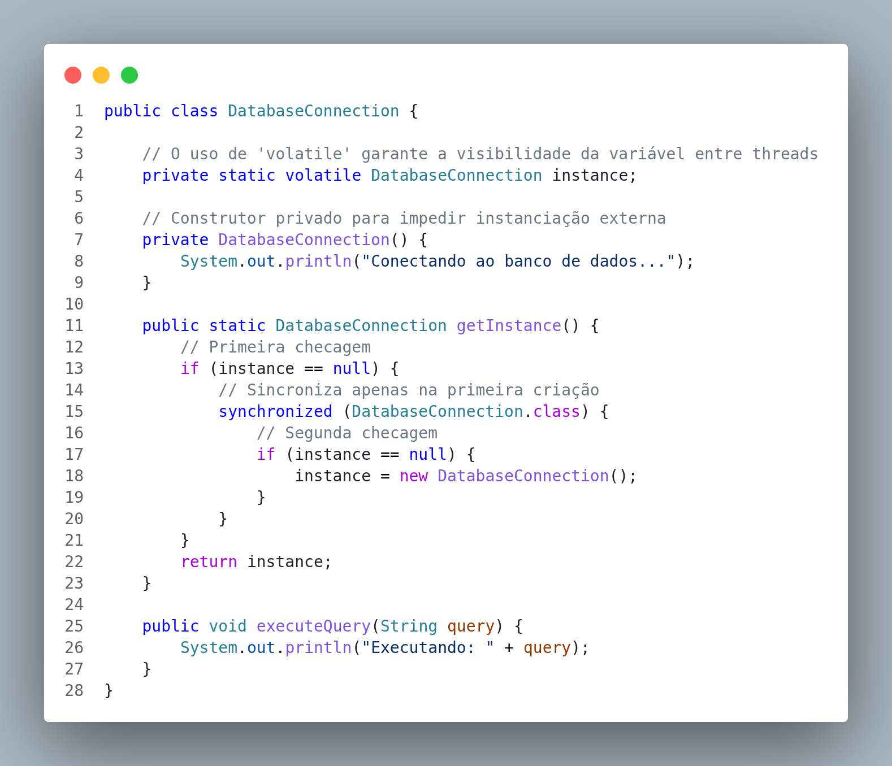
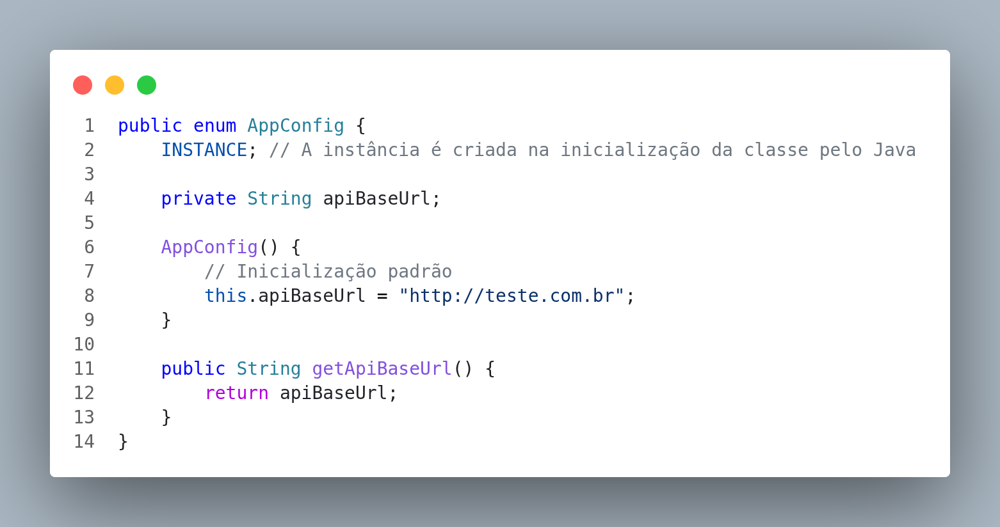
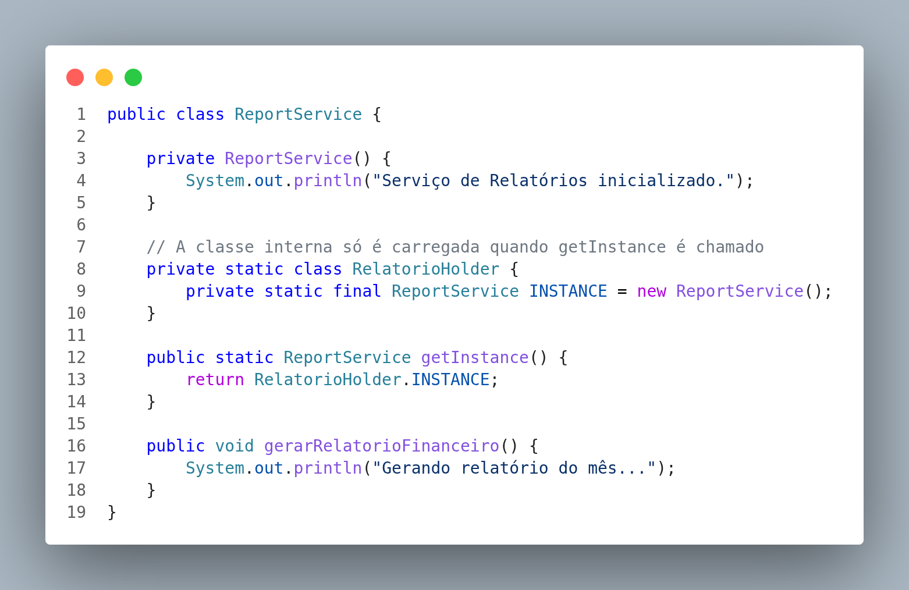
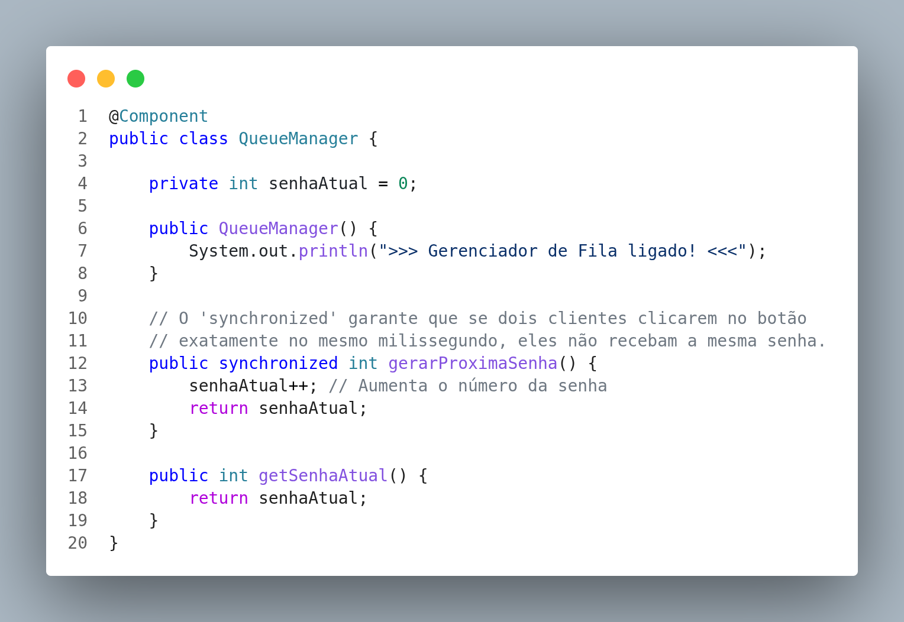
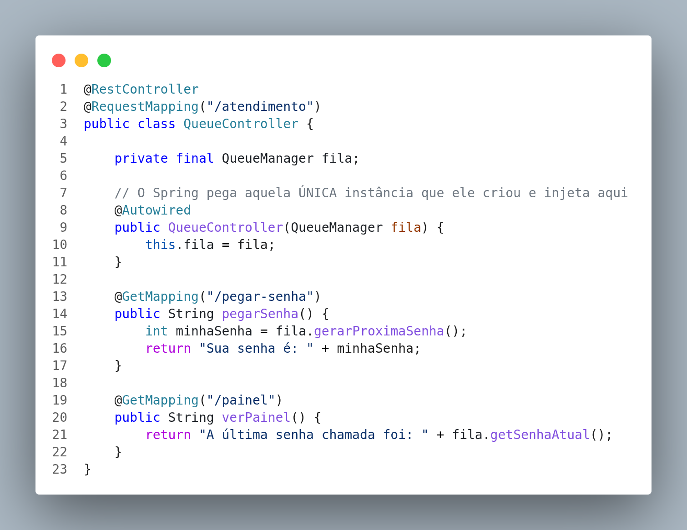

# Padrão de Projeto: Singleton em Java

## 🎯 Intenção do Padrão
O padrão **Singleton** é um padrão de projeto criacional que garante que uma classe tenha **apenas uma única instância** em todo o ciclo de vida da aplicação, fornecendo um ponto global de acesso a essa instância.

## 📌 Contexto Acadêmico
* **Disciplina:** Pradrões de Projeto
* **Curso:** Engenharia de Software (4º Período)
* **Instituição:** Universidade de Pernambuco (UPE)
* **Autores:** Márcio Ferreira Lima, Lucas Nascimento e Wevertton David.

## 🏗️ Diagrama UML
Abaixo, a representação estrutural de como o padrão é implementado para proteger a instanciação da classe:


## 💻 Implementações Desenvolvidas
Neste repositório, o padrão foi explorado da sua forma mais básica até abordagens otimizadas para ambientes de alta concorrência (*thread-safe*):

1. **`SimpleSingleton`**: Implementação básica (*Lazy Initialization*). Não é segura para concorrência.
2. **`SynchronizedSingleton`**: Segura para threads, mas com gargalo de performance devido ao bloqueio no método `getInstance()`.
3. **`Singleton` (Double-Checked Locking)**: Otimização usando `volatile` e blocos sincronizados apenas quando estritamente necessário.
4. **`EagerSingleton`**: Instanciação no carregamento da classe. Segura, mas pode desperdiçar memória.
5. **`BillPughSingleton`**: Utilização de classe estática interna. Garante *lazy initialization* e alta performance sem `synchronized`.
6. **`EnumSingleton`**: A abordagem mais recomendada em Java moderno. Protege contra *Reflection* e problemas de serialização.

## 🌍 Aplicações Práticas (Exemplos Implementados)

Durante os estudos, alguns cenários reais onde o Singleton faz sentido foram mapeados:

* **Gerenciador de Banco de Dados:** Centraliza o pool de conexões.
  

* **Configurações da Aplicação (AppConfig):** Mantém variáveis em memória utilizando a solidez do Enum Singleton.
  

* **Serviço de Relatórios:** Utiliza a técnica de Bill Pugh para inicializar um serviço pesado apenas quando ele for de fato invocado.
  

* **Gerenciador de Fila (Spring Boot):** Aproveita a natureza de Singletons nativos do Spring (anotação `@Component`) para garantir a consistência das senhas geradas no atendimento.
  
  

## ⚖️ Análise Crítica: Quando usar e evitar

### ✅ Casos de Uso Recomendados
* **Pools de Conexão:** Reutilizar conexões de banco de dados para evitar sobrecarga no servidor.
* **Acesso a Hardware/Recursos Físicos:** Filas de impressão, comunicação com sensores (ex: portas seriais com Arduino) para evitar colisão de dados.
* **Cache de Configurações Globais:** Carregar as credenciais da aplicação apenas uma vez na inicialização.

### ❌ Quando Evitar (Anti-patterns)
* **Objetos de Domínio:** Representações com estado (Ex: `Agendamento`, `Cliente`) nunca devem ser Singletons, pois o estado não pode ser compartilhado globalmente.
* **Projetos com TDD Estrito:** O uso de dependências globais dificulta a injeção de Mocks durante os testes unitários.
* **Aplicações SaaS Multi-Tenant:** Em plataformas que atendem várias empresas simultaneamente, variáveis globais podem causar vazamento de dados entre os clientes.

### Para usar a aplicação

Utilize o Maven Wrapper nativo para compilar e testar a aplicação:

**No Linux/macOS:**
```bash
./mvnw test
```

**No Windows:**
```cmd
mvnw.cmd test
```